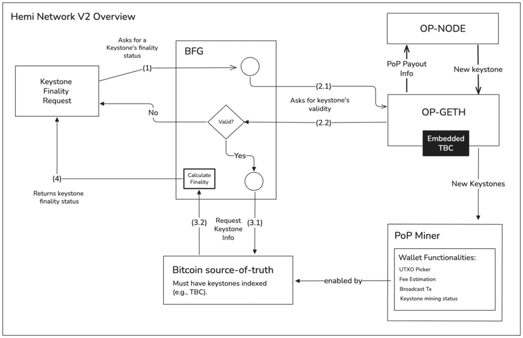
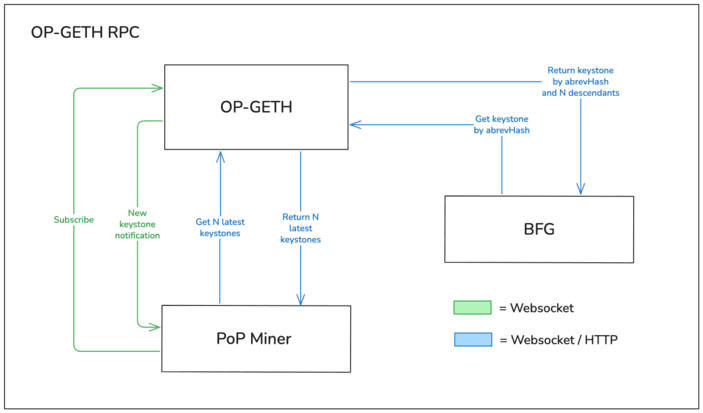
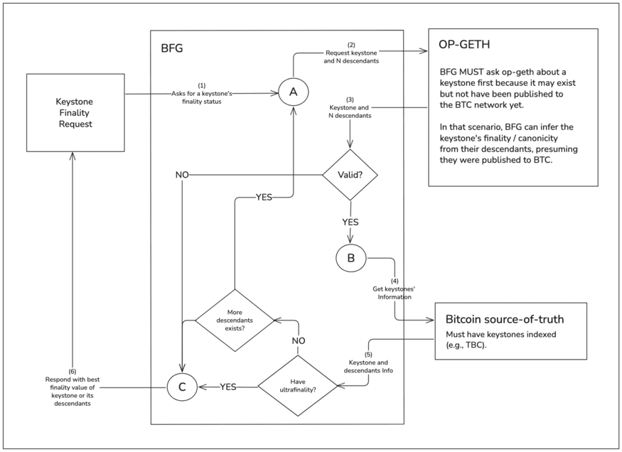

# HIPPO-003

``` 
HIPPO: 3 
Title: Hemi Network V2 Upgrade
Author: António Martins <antono@hemi.xyz> 
Comments-Summary: No comments yet. 
Status: New 
Type: Network 
Created: 2025-10-29 
``` 

## Background and Motivation

Over time, previously crucial parts of the Hemi network have become bloated and/or obsolete, hindering forward progress due to increasing technical debt. The Bitcoin Secure Sequence (BSS), for example, was previously an integral part of ensuring communication between the ethereum consensus layer and the Bitcoin Finality Governor (BFG), facilitating the sharing of information related to new keystones, their finality status, and Proof-of-Proof (PoP) payouts. However, as the network matured, BSS has become just a proxy through which communication must pass, with no clear benefit.

Furthermore, as the network is expected to grow and scale, it has become unfeasible to rely on certain components to bear the brunt of storing data and managing interactions between multiple parts of the network. This is the case for BFG, whose central purpose is to, as the name implies, ascertain the finality of L2 keystones relayed to the Bitcoin network by PoP miners. However, rather than solely retaining its expectedly stateless purpose, it grew to fill other roles, such as that of relaying information to PoP miners, and even storing data related to keystones and their finality.

While these choices had originally made sense, at a time in the development of the Hemi network where specific features and capabilities were not yet evenly distributed throughout all major components of the network, this is no longer the case. In order to facilitate further development, decrease communication overhead, permit decentralization of network components, and improve security, a general refactoring and pruning of the network is desirable. As such, the Hemi Network V2 upgrade can be seen as an optimization problem, where the communication and role of major pieces of the network is streamlined, so as to maximize their utility in a scalable manner.

## Specification

Several key elements of the network have been altered or otherwise consolidated in this network upgrade.



The following sub-sections go into further detail about the major changes made to each component of the network.

### Bitcoin Secure Sequence (BSS)

BSS, which acted as a gateway to BFG, managing the consensus mechanisms of the Hemi Network, has been completely removed. It no longer served any purpose beyond acting as a gateway for communication between the Bitcoin and Ethereum components of the network, which is now done directly by said components, without using BSS as an intermediary.

### Ethereum Execution Layer (op-geth)

The Ethereum execution client, op-geth, would previously communicate solely with op-node, the Ethereum consensus client. However, it now communicates with PoP miners, notifying them of new keystones available for mining, as well as BFG, responding to queries about a keystone and its descendants' validity during finality calculation.

To do so, op-geth clients in the Hemi Network now expose a JSON-RPC interface, where subscription-based notifications are relayed through websocket connections, and other requests are relayed either through websocket connections or HTTP requests. Additionally, op-geth must now store information about every keystone derived from the canonical chain, which will require additional storage space.



When requested, PoP payout information is now relayed to op-node by op-geth, which retrieves this information using its embedded Tiny Bitcoin (TBC) client.

### Ethereum Consensus Layer (op-node)

The Ethereum consensus client, op-node, no longer communicates with BFG through BSS. All communication, including requesting PoP payout information, is done with op-geth.

### Proof-Of-Proof (PoP) Miners

PoP miners no longer communicate with BFG. Instead, they communicate with an op-geth client to receive notifications regarding new keystones available for mining. Furthermore, all functionality and information about the Bitcoin chain - such as broadcasting transactions or fee estimation - are handled by a keystone-indexing Bitcoin source-of-truth, such as TBC.

### Tiny Bitcoin (TBC)

TBC, Hemi's lightweight Bitcoin node, can now optionally calculate Bitcoin fees dynamically using an internal mempool, useful for PoP miners who use TBC for communication with Bitcoin. TBC is now also able to answer queries related to keystones present at certain block heights, which is leveraged by op-geth for calculating PoP payouts. This requires an automatic database upgrade on the part of any previously long running TBC nodes.

### Bitcoin Finality Governor (BFG)

BFG has been drastically simplified, and now runs in a stateless manner. Its only purpose is to receive and respond to queries asking for the finality value of a keystone (i.e., how deep a keystone is in the Bitcoin chain).



Upon receiving a finality request for a keystone, the request is relayed to op-geth, ascertaining the existence of that keystone and up to N descendants. If op-geth is unaware of the keystone, then it must not be present in the canonical chain, and is considered invalid.

In order to calculate the finality of a keystone, BFG then requests information about the presence and depth of these keystones in the Bitcoin chain from a keystone-indexing Bitcoin source-of-truth (e.g., TBC). A keystone inherits the finality value of any descendant whose finality value is greater than its own, as the presence of a keystone in the Bitcoin chain validates the canonicity of every one of its ancestor keystones. Thus, BFG continuously sends requests to op-geth requesting increasingly distant descendants.

Once no more descendants can be retrieved or one of the retrieved keystones has achieved ultrafinality - the point after which a keystone is deep enough in the Bitcoin chain that there is no practical value in calculating a better finality value - the best finality value of any of the keystones is returned back to the caller.

## Compatibility
This upgrade is breaking to most nodes and daemons. Those running standalone daemons should follow the instructions in the [heminetwork repository](https://github.com/hemilabs/heminetwork), in order to update to the latest version. Similarly, node runners should upgrade their nodes by following the instructions in the [hemi-node repository](https://github.com/hemilabs/hemi-node).

## Changelog

2025-10-29 Initial version.
